# Create Developer Compute VM on Oracle Cloud Infrastructure #

To complete the tutorial you need to have certain tools to be installed. To simplify the environment prerequisites we provide Virtualbox image including all the necessary tools.
However in few cases Windows version and/or corporate policies, settings doesn't allow to run Virtualbox on your computer.
In such situation we provide one more option to minimise the installation impact on your desktop. Following this short guide you can setup developer compute instance using Oracle Cloud Infrastructure. In this case you only need `ssh` client to connect to the remote developer instance where all the necessary tools installed to complete the workshop.

### Prerequisites ###

[Oracle Cloud Infrastructure](https://cloud.oracle.com/en_US/cloud-infrastructure) enabled account.

To create compute instance the following steps need to be completed:

- Create network resource: Virtual Cloud Network (VCN)
- Create Compute Instance
- Connecting to the VM using SSH
- Setup development environment on Compute Instance

#### Open the OCI console ####

When you sign up to use Oracle Cloud Infrastructure, you receive a customized URL for your organization. You can sign in directly to Oracle Cloud Infrastructure using the Console URL. For example,

`https://console.us-ashburn-1.oraclecloud.com/?tenant=CompanyABC`

If you instead use the base URL (for example: https://console.us-ashburn-1.oraclecloud.com), you are prompted to specify your tenant (or cloud account name) on the sign-in page, along with your user name and password. (More information and list of regional Console URLs available in the [documentation](https://docs.cloud.oracle.com/iaas/Content/GSG/Tasks/signingin.htm#))

Enter your tenant if necessary and click **Continue**.


Use your username, password and click **Sign In**.


You have to land on the OCI console page.

#### Create network resource: Virtual Cloud Network (VCN) ####

Click the hamburger menu icon at the top left corner and select **Networking** on the left sliding menu then click **Virtual Cloud Networks**.


On the Virtual Cloud Networks page click **Networking Quickstart**.

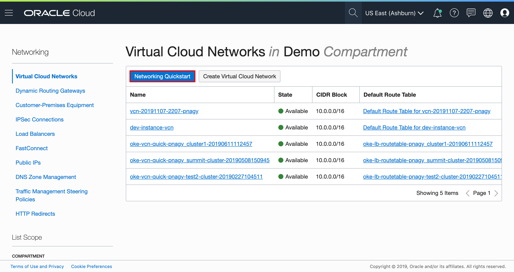

In the Networking Quickstart dialog, select *VCN with Internet Connectivity*. Then click **Start Workflow**.

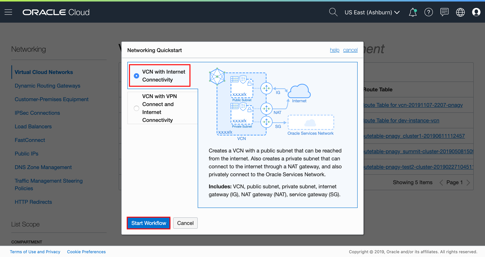

In the create page specify the following configuration details:
- **VCN NAME**: Enter a name for your cloud network, what helps you later to identify this resource. In this example: *vcn-20191129-dev-pnagy*
- **COMPARTMENT**: By default, this field displays your current compartment.
- **VCN CIDR BLOCK**: 10.0.0.0/16
- **PUBLIC SUBNET CIDR BLOCK**: 10.0.0.0/24
- **PRIVATE SUBNET CIDR BLOCK**: 10.0.1.0/24
- **USE DNS HOSTNAMES IN THIS VCN**: Leave the selected -default- *USE DNS HOSTNAMES IN THIS VCN* .

Click **Next**.

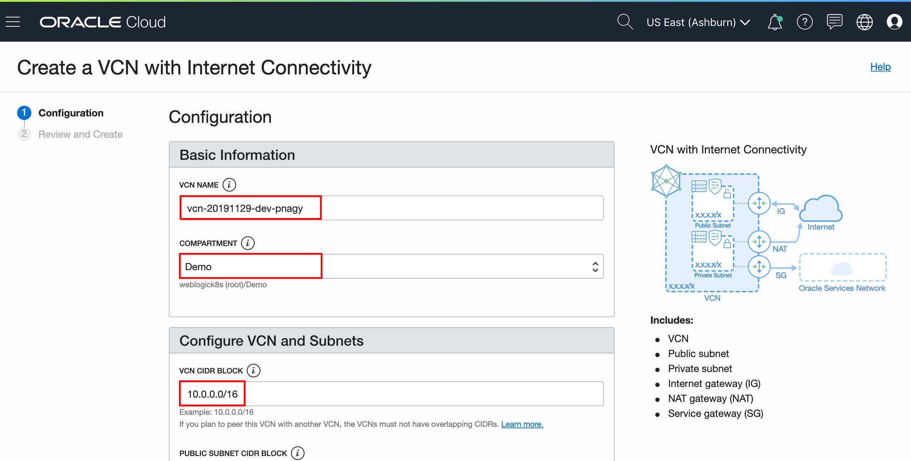
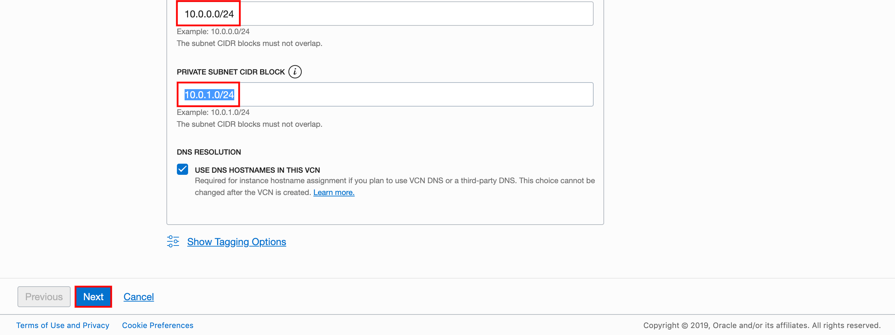

You can review the configuration of the VCN, subnets, security lists and route rules in the Review page. Click **Create** to start creating the VCN with resources.

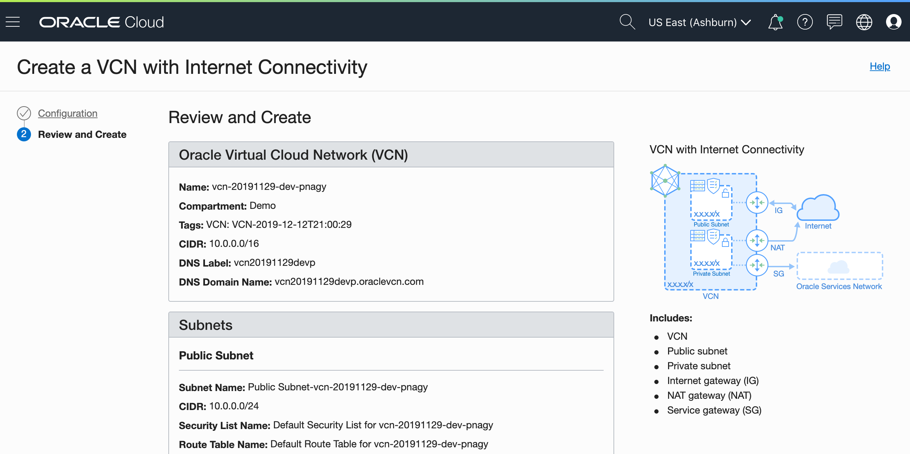
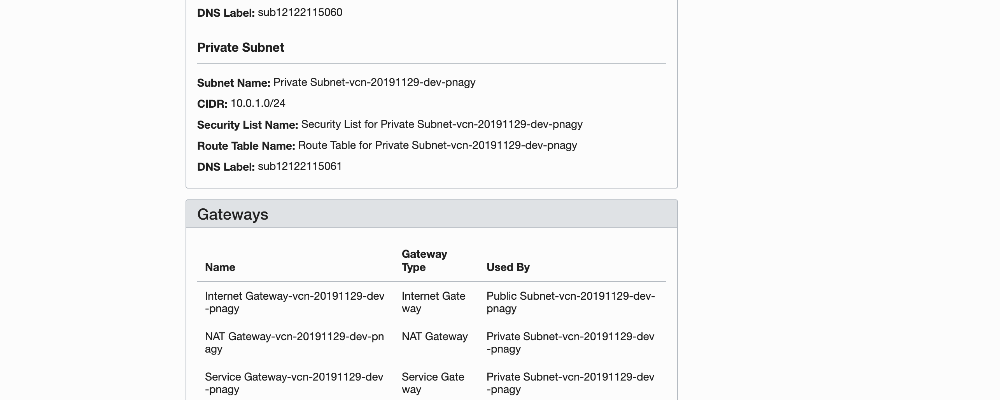


The VCN is created with all the components. Click on **View Virtual Cloud Network** to enter the VCN.

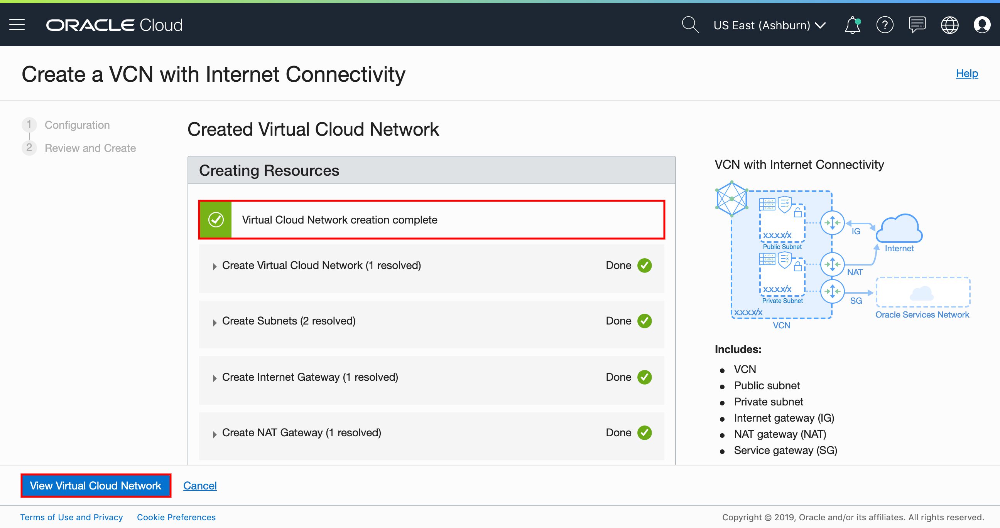


#### Create Compute VM ####

##### Create SSH Key #####

Before you start, you are going to need a key pair for authentication to your instance. The following applies for UNIX and UNIX-Like Platforms. Open a terminal and execute the following commands:
```bash
$ ssh-keygen -b 2048 -t rsa -f ~/.ssh/myDeveloperComputeKey
$ chmod 600 ~/.ssh/myDeveloperComputeKey*
```
If you have any problems, or need instructions for using PuTTYgen on Windows, check out the documentation [here](http://docs.oracle.com/cloud/latest/dbcs_dbaas/CSDBI/GUID-4285B8CF-A228-4B89-9552-FE6446B5A673.htm#CSDBI3349).

Open your OCI console and use the top-left menu to select the **Compute > Instances** option.
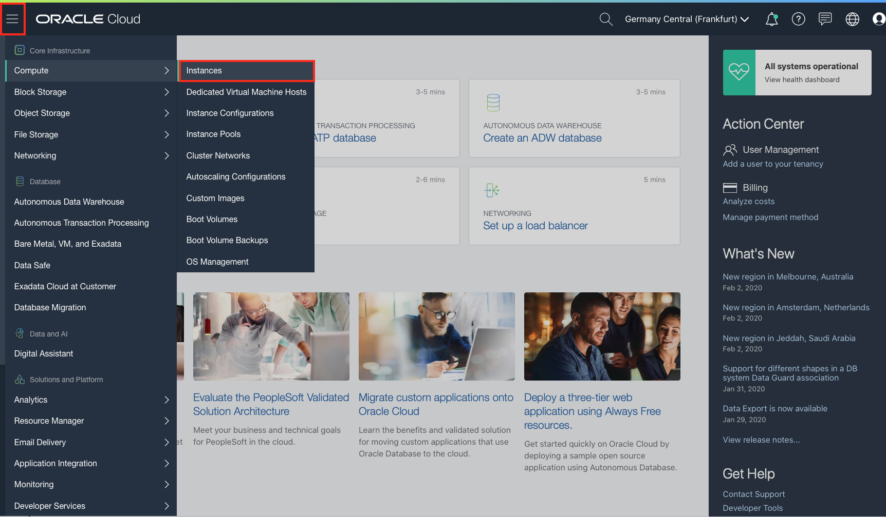

Click the **Create Instance** button on the compute dashboard.
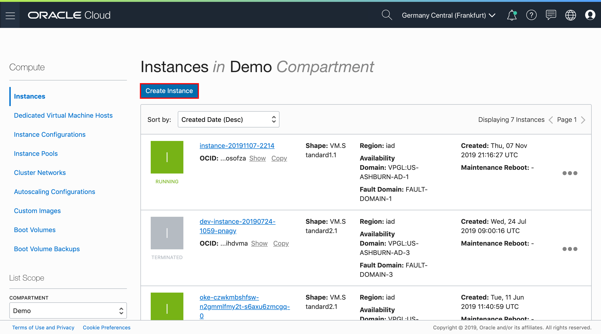

Fill in the instance details, including the instance name and the operating system image. To change the image source click **Change Image Source** button.
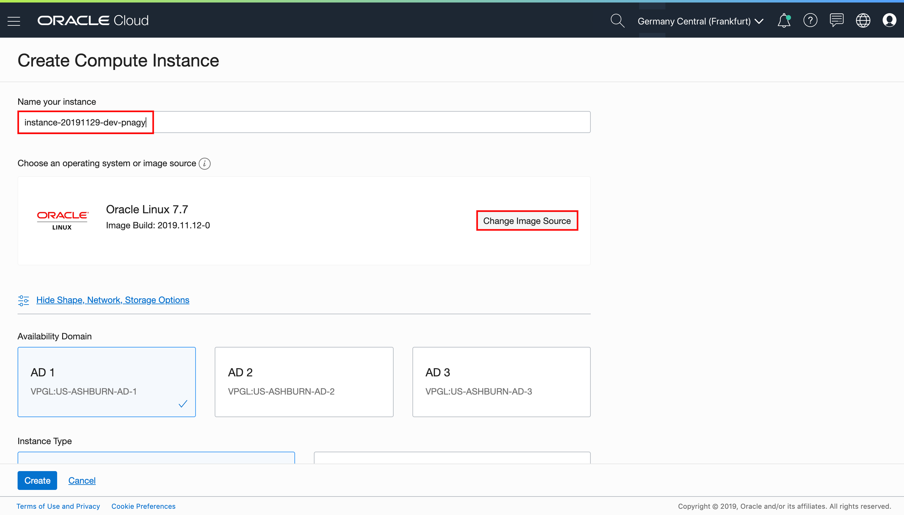

Select the image with *CentOS7* operating system. Click **Select Image**.
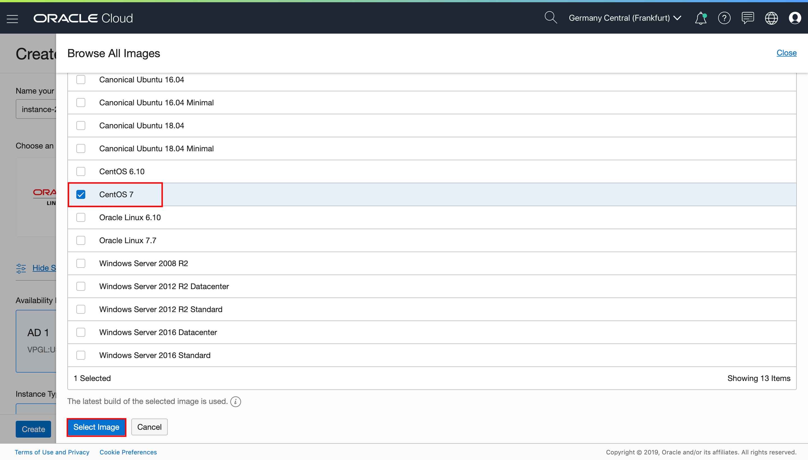

Specify the remaining configuration details:
- **Availability domain**: Leave the default *AD 1*
- **Instance Type**: Leave the default *Virtual machine*
- **Instance Shape**: It can be any small images or the default.
- **Virtual cloud network compartment**: Leave your default.
- **Virtual cloud network**: Most likely the default is the VCN what you created in the previous step. If not then select what you just created above.
- **Subnet compartment**: Leave your default.
- **Subnet**: Make sure the public(!) subnet e.g.:*Public Subnet-xxx (Regional)* is selected.
- **Assign a public IP address**: select this option to allow external access (`ssh`) to your compute VM.
- **Add SSH key**: select the previously created `~/.ssh/myDeveloperComputeKey.pub` or copy and paste its content to the *SSH key* field.

Your compute VM configuration should look like the following:
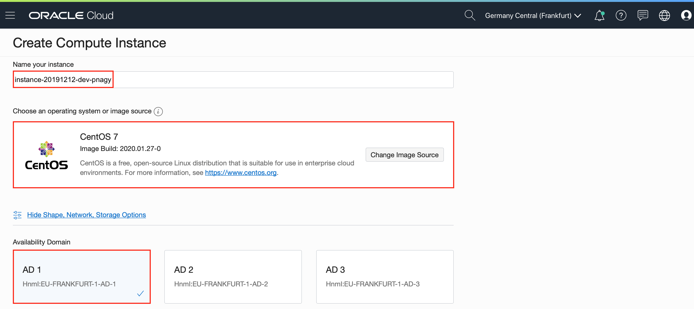
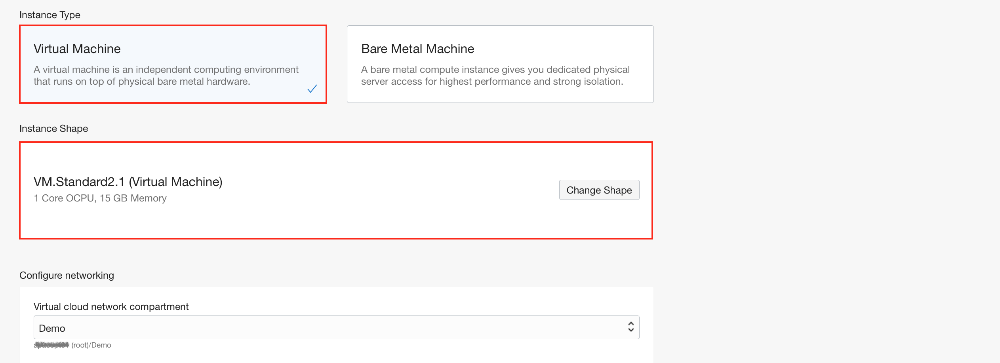
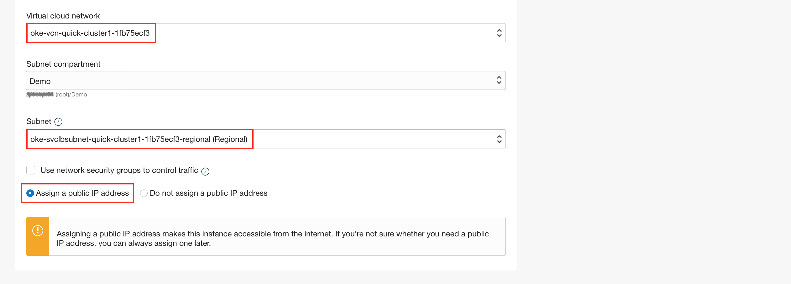
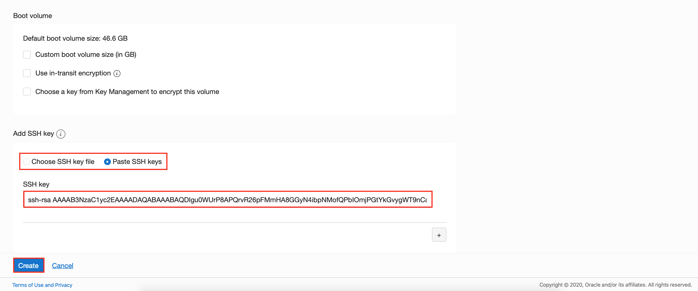


Click **Create** and wait for the instance to be provisioned. When it is completed and running get the Public IP address of the VM.
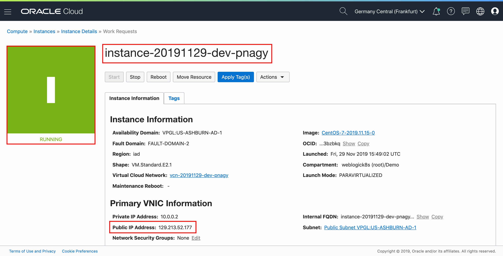

#### Connecting to the VM using SSH ####

Connect to the "opc" operating system user by specifying your private key and the public IP address.
```bash
$ ssh -i ~/.ssh/oow.id_rsa opc@129.213.52.177
The authenticity of host '129.213.52.177 (129.213.52.177)' can't be established.
ECDSA key fingerprint is SHA256:zV7AVr1/Jkkt3KQXp6SsNHWIc8tlrpmSnX8xlTwe330.
Are you sure you want to continue connecting (yes/no)? yes
Warning: Permanently added '129.213.52.177' (ECDSA) to the list of known hosts.
[opc@instance-20191129-dev-pnagy ~]$
```

#### Setup development environment on Compute VM ####

Once you have connected to the compute VM run a single remote script to setup the necessary tools:
```bash
bash <(curl -s https://raw.githubusercontent.com/nagypeter/vmcontrol/master/setup-operator-workshop.sh)
```

When the script finished your compute VM is ready to use for the workshop.
