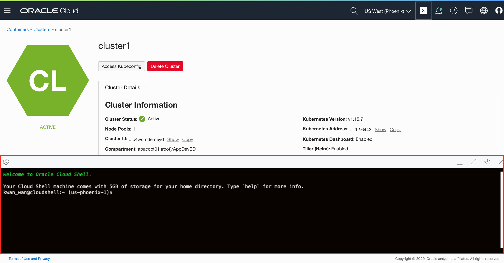
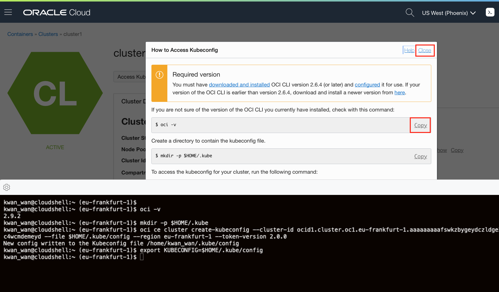

# Lab 2: Setup Kubernetes Command-Line Tool **kubectl** #

Oracle Cloud Infrastructure Container Engine for Kubernetes is a fully-managed, scalable, and highly available service that you can use to deploy your containerised applications to the cloud. Container Engine leverages standard upstream Kubernetes, validated against the CNCF conformance program, ensuring portability across clouds and on-premises. You can manage your OKE cluster using **kubectl**, a command line tool for controlling Kubernetes clusters

## Prerequisites ##

To config the **kubectl** command-line tool for controlling Kubernetes clusters the following steps need to be completed:

- a provisioned Oracle Container Engine for Kubernetes (OKE) cluster
- an Oracle Cloud Shell

## Configure Kubernetes command-line Tool `kubectl` ##

When you create a cluster, you need to download a Kubernetes configuration file (commonly known as a `kubeconfig` file) for the cluster. The `kubeconfig` file is required by the Kubernetes command-line tool `kubectl` for controlling and managing Kubernetes clusters. You have to use OCI CLI to authenticate and download the `kubeconfig` file. You can work locally with OCI CLI installed on your laptop or in an Oracle Cloud Shell where OCI CLI is preinstalled and configured.

**For the rest of the labs, you will be using Oracle Cloud Shell to carry out all command line tasks. The Oracle Cloud Shell has OCI CLI preinstalled and configured, making it much more user friendly.**

---

**Note**: As you are using Oracle Cloud Shell, the `kubectl` is already installed. There is no need to install `kubectl` separately.

---

To download the `kubeconfig` configuration file, open the navigation menu and under **Developer Services**, click **Clusters**. Select your cluster and click to get the detail page.

Click on the Oracle Cloud Shell icon along the top of the console to open it. The Cloud Shell will open up at the bottom of the page. Wait a moment whilst the shell sets up.

Click **Access Kubeconfig**

A dialog pops up which contains the customized OCI command that you need to execute to download the Kubernetes configuration file.

Copy and execute the commands in your Cloud Shell. You will need to copy, close the **How to Access Kubeconfig** dialog box and execute the command one at a time in the Cloud Shell. For example:

- Copy `oci -v`
- Click **Close** to close the pop up dialog box
- Paste command into the Cloud Shell and enter return to execute it
- Observe command output
- Click **Access Kubeconfig**
- Repeat for next command `mkdir -p $HOME/.kube` until all commands have been executed.

**Note**: For `kubectl` try to use by default `$HOME/.kube/config` configuration file. If you save it to a different location and use different filename, don't forget to set the `KUBECONFIG`  variable to the configuration file. E.g.:

	export KUBECONFIG=another_folder_path/kubernetes_config_file_name

Now check that `kubectl` is working, for example using the `get node` command. Enter the following command in your Cloud Shell:

	$ kubectl get node
	NAME            STATUS    ROLES     AGE       VERSION
	130.61.58.206   Ready     node      16m       v1.11.5
	130.61.60.127   Ready     node      16m       v1.11.5
	130.61.72.48    Ready     node      16m       v1.11.5

If you see the node's information the configuration was successful. Probably the Name column will contain the IPs that are non-routable

## Set up the RBAC policy for the OKE cluster ##

In order to have permission to access the Kubernetes cluster, you need to authorize your OCI account as a cluster-admin on the OCI Container Engine for Kubernetes cluster. This will require your user OCID, which you used to configure OCI CLI few steps above. (This information available on the OCI console page, under your user settings.)

Then execute the role binding command using your(!) user OCID:

	kubectl create clusterrolebinding my-cluster-admin-binding --clusterrole=cluster-admin --user=<YOUR_USER_OCID>

For example:

	$ kubectl create clusterrolebinding my-cluster-admin-binding --clusterrole=cluster-admin --user=ocid1.user.oc1..AGAIN_THIS_IS_EXAMPLE
	clusterrolebinding "my-cluster-admin-binding" created

Congratulation, now your OCI OKE environment is ready to deploy your WebLogic domain.

### You are now ready to move to the next lab - [Lab 3: Install WebLogic Operator](install.operator.md)  ###
