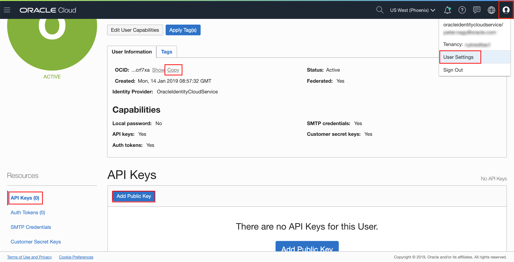
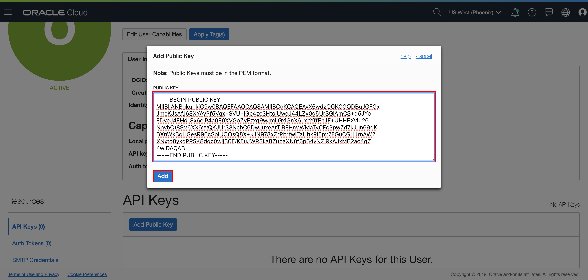
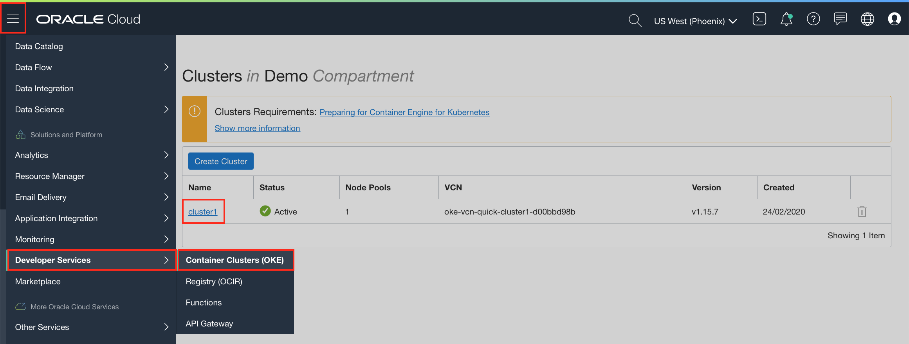
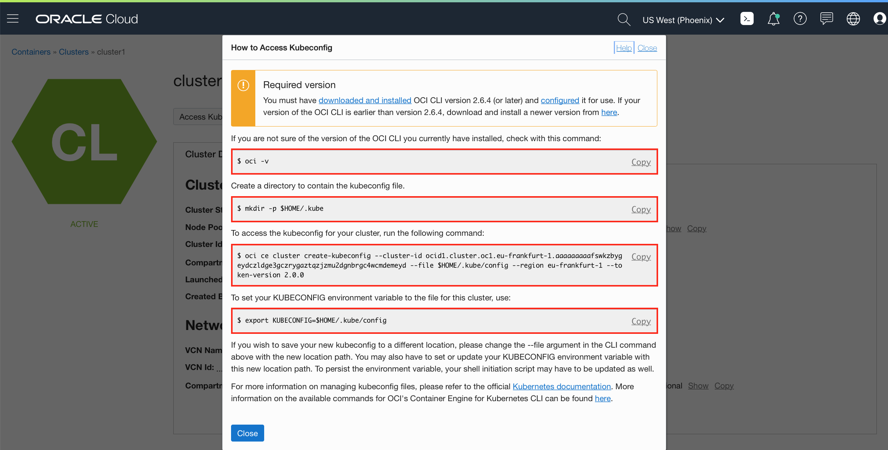

# Lab 3: Setup Kubernetes Command-Line Tool **kubectl** #

Oracle Cloud Infrastructure Container Engine for Kubernetes is a fully-managed, scalable, and highly available service that you can use to deploy your containerised applications to the cloud. Container Engine leverages standard upstream Kubernetes, validated against the CNCF conformance program, ensuring portability across clouds and on-premises. You can manage your OKE cluster using **kubectl**, a command line tool for controlling Kubernetes clusters

## Prerequisites ##

To config the **kubectl** command-line tool for controlling Kubernetes clusters the following steps need to be completed:

- a provisioned Oracle Container Engine for Kubernetes (OKE) cluster
- a provisioned Developer Compute VM on OCI

## Prepare OCI CLI to download Kubernetes configuration file ##

When you create a cluster, you need to download a Kubernetes configuration file (commonly known as a `kubeconfig` file) for the cluster. **To do so you have to add OCI API Signing key and configure OCI CLI on your workstation (Remote Compute VM environment)**.

## Configure OCI CLI ##

You will be working in the Developer Compute VM you setup in the previous lab for this lab.

Connect to your Compute VM if you have not done so already.

Before using the CLI, you have to create a config file that contains the required credentials for working with Oracle Cloud Infrastructure. To have this config the CLI walks you through the first-time setup process, step by step, use the `oci setup config` command. The command prompts you for the information required for the config file and the API public/private keys. The setup dialog generates an API key pair and creates the config file.

Before you start the setup collect the necessary information using your OCI console.

- User OCID
- Tenancy OCID
- Region

In the Console click on your OCI user name and select User Settings. On the user details page you can find the *user OCID*. Click **Copy** and paste temporary to a text editor.

To identify *tenancy OCID* in the Console, open the navigation menu. Under *Governance and Administration*, go to *Administration* and click **Tenancy Details**. Click **Copy** to get tenancy OCID on clipboard. Paste to your text editor for OCI CLI configuration.

As for the region, you can find this along the top of the console. It can Frankfurt, London, Ashburn, or Phoenix.

Leave the console open during CLI configuration and copy the required information from the console page or from text editor where you collected the OCIDs (user and tenancy). When you want to accept the default value what is offered in square bracket just hit Enter.

---

**Note**: If you need to install OCI CLI on your laptop natively then follow the [documentation](https://docs.cloud.oracle.com/iaas/Content/API/SDKDocs/cliinstall.htm).

Otherwise OCI CLI is installed by default in the Developer Compute VM environment.

---

Execute `oci setup config` command to setup the CLI:

	$ oci setup config
	    This command provides a walkthrough of creating a valid CLI config file.

	    The following links explain where to find the information required by this
	    script:

	    User OCID and Tenancy OCID:

	        https://docs.us-phoenix-1.oraclecloud.com/Content/API/Concepts/apisigningkey.htm#Other

	    Region:

	        https://docs.us-phoenix-1.oraclecloud.com/Content/General/Concepts/regions.htm

	    General config documentation:

	        https://docs.us-phoenix-1.oraclecloud.com/Content/API/Concepts/sdkconfig.htm

	Enter a location for your config [/home/oracle/.oci/config]:

Enter to accept default directory location `/home/oracle/.oci/config`. Provide your user and tenancy OCIDs.

	Enter a user OCID: <YOUR_USER_OCID>
	Enter a tenancy OCID: <YOUR_TENANCY_OCID>

Enter your region. You can see in the console (browser) at the top right area. It has to be *eu-frankfurt-1*, if not type the proper region code.

	Enter a region (e.g. eu-frankfurt-1, uk-london-1, us-ashburn-1, us-phoenix-1): <YOUR_REGION>

Generate new API signing key by entering `Y` at the prompt. For the location accept default.

**Don't use a passphrase for the private key**. Just hit return for no passphrase.

	Do you want to generate a new RSA key pair? (If you decline you will be asked to supply the path to an existing key.) [Y/N]: Y

	Enter a directory for your keys to be created [/home/oracle/.oci]:
	Enter a name for your key [oci_api_key]:
	Public key written to: /home/oracle/.oci/oci_api_key_public.pem
	Enter a passphrase for your private key (empty for no passphrase):
	Private key written to: /home/oracle/.oci/oci_api_key.pem
	Fingerprint: 41:ea:cf:23:01:a2:bb:fb:84:79:34:8e:fe:bc:18:4f
	Config written to /home/oracle/.oci/config

## Upload the public key of the API signing key pair ##

The final step to complete the CLI setup to upload your freshly generated public key through the console. The public key if you haven't changed it during setup can be found in the `/home/oracle/.oci/` directory and it's name `oci_api_key_public.pem`. Using your favourite way copy its content to the clipboard. While viewing user details click **Add Public Key**.

Copy the content of the `oci_api_key_public.pem` file into the *PUBLIC KEY* text area and click **Add**.

The key is uploaded and its fingerprint is displayed in the list.

## Configuring kubectl ##

---

**Note**: If you are using the Developer Compute VM, then `kubectl` is already installed. Otherwise, if you need to install `kubectl` then follow the [documentation](https://kubernetes.io/docs/tasks/tools/install-kubectl/).

---

The CLI setup now is done. To complete the `kubectl` configuration open the navigation menu and under **Developer Services**, click **Clusters**. Select your cluster and click to get the detail page.

Click **Access Kubeconfig**

A dialog pops up which contains the customized OCI command that you need to execute to create Kubernetes configuration file.

Copy and execute the commands on your desktop where OCI CLI was configured. For example:

	$ mkdir -p $HOME/.kube
	$ oci ce cluster create-kubeconfig --cluster-id ocid1.cluster.oc1.eu-frankfurt-1.aaaaaaaaaezwenlfgm4gkmzxha2tamtcgjqwmoldmu3tcnlfgc2tcyzzmrqw --file $HOME/.kube/config --region eu-frankfurt-1

**Note**: For `kubectl` try to use by defult `$HOME/.kube/config` configuration file. If you save it to a different location and use different filename, don't forget to set the `KUBECONFIG`  variable to the configuration file. E.g.:

	export KUBECONFIG=another_folder_path/kubernetes_config_file_name

Now check that `kubectl` is working, for example using the `get node` command:

	$ kubectl get node
	NAME            STATUS    ROLES     AGE       VERSION
	130.61.58.206   Ready     node      16m       v1.11.5
	130.61.60.127   Ready     node      16m       v1.11.5
	130.61.72.48    Ready     node      16m       v1.11.5

If you see the node's information the configuration was successful. Probably the Name column will contain the IPs that are non-routable

## Set up the RBAC policy for the OKE cluster ##

In order to have permission to access the Kubernetes cluster, you need to authorize your OCI account as a cluster-admin on the OCI Container Engine for Kubernetes cluster. This will require your user OCID, which you used to configure OCI CLI few steps above. (This information available on the OCI console page, under your user settings.)

Then execute the role binding command using your(!) user OCID:

	kubectl create clusterrolebinding my-cluster-admin-binding --clusterrole=cluster-admin --user=<YOUR_USER_OCID>

For example:

	$ kubectl create clusterrolebinding my-cluster-admin-binding --clusterrole=cluster-admin --user=ocid1.user.oc1..AGAIN_THIS_IS_EXAMPLE
	clusterrolebinding "my-cluster-admin-binding" created

Congratulation, now your OCI OKE environment is ready to deploy your WebLogic domain.

### You are now ready to move to the next lab - [Lab 4: Install WebLogic Operator](install.operator.md)  ###
