# Lab 1: Create Oracle Container Engine for Kubernetes (OKE) on Oracle Cloud Infrastructure (OCI) #

Oracle Cloud Infrastructure Container Engine for Kubernetes is a fully-managed, scalable, and highly available service that you can use to deploy your containerised applications to the cloud. Use Container Engine for Kubernetes (sometimes abbreviated to just OKE) when your development team wants to reliably build, deploy, and manage cloud-native applications. You specify the compute resources that your applications require, and Container Engine for Kubernetes provisions them on Oracle Cloud Infrastructure in an existing OCI tenancy.

## Prerequisites ##

[Oracle Cloud Infrastructure](https://cloud.oracle.com/en_US/cloud-infrastructure) enabled account.

To create Container Engine for Kubernetes (OKE) the following steps need to be completed:

- Create network resources (VCN, Subnets, Security lists, etc.)
- Create Cluster.
- Create NodePool.

This tutorial shows the simplest way the *Quick Start* feature creates and configures all the necessary resources for a 3 Kubernetes node cluster. All the nodes will be deployed in different Availability Domains to ensure high availability.

More information about OKE and custom cluster deployment:

- [Oracle Container Engine documentation](https://docs.cloud.oracle.com/iaas/Content/ContEng/Concepts/contengoverview.htm)

## Open the OCI console ##

If you have signed into your OCI console before, you can go straight to the [OCI console page](https://console.us-ashburn-1.oraclecloud.com/#/a/)

  - Enter your Cloud Tenant and click **Continue**

  

  - Click **Continue** in the left hand box to sign in with your SSO credentials

  

### Otherwise:

Sign in using your Cloud Services link you got in email during the registration process. (If this is the first time you have to change the generated first time password.)

Enter your username and password from your Trial Account sign up. Click **Sign In**.

Click the menu icon at the top left corner and select **Compute** on the left sliding menu.

You have to land on the OCI console page.

## Create a Compartment For Your OKE (Oracle Container Engine for Kubernetes) cluster ##

Compartments are used to isolate resources within your OCI tenant. Role-based access policies can be applied to manage access to compute instances and other resources within a Compartment.

Click the **hamburger icon** in the upper left corner to open the navigation menu. Under the **Identity** section of the menu, click **Compartments**

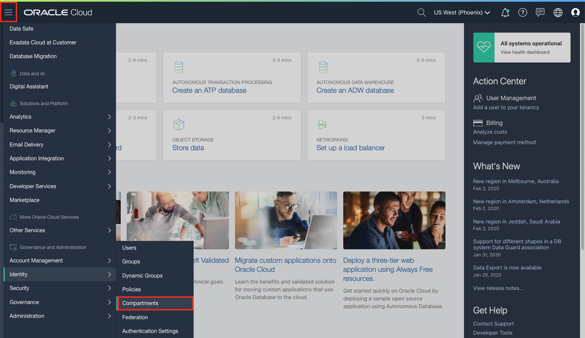

Click **Create Compartment** to create a compartment.

Enter the following:

- **Name:** A unique name for your compartment. This must not be already used in your current tenancy.
- **Description:** A friendly description.
- **Parent Compartment:** Ensure the `root` compartment is selected (it will have the same name as your Oracle Cloud Account).

Click **Create Compartment**.

  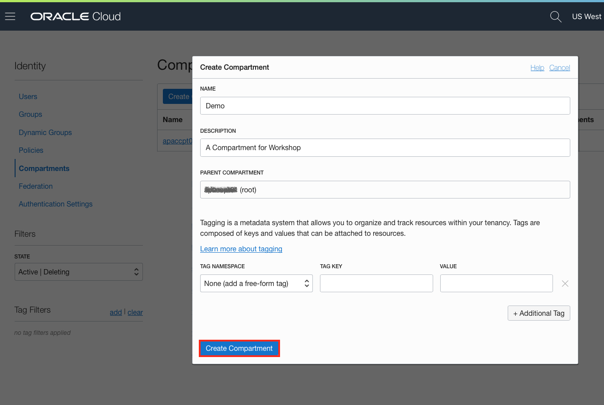

## Create Policy ##

A service policy allows OKE to create resources in tenancy such as compute. An OKE resource policy or policies enables you to regulate which groups in your tenancy can do what with the OKE API.

Optionally create more resource policies if you want to regulate which groups can access different parts of the OKE service.

---

**Note**: A service policy for OKE is a global policy that applies to a tenancy. You **MAY NOT** need to create this if:

  - you are using your **Corporate UC account**, this service policy will be created for you. **You DO NOT need to create this policy. Please go to the next section to Create OKE Cluster**.
  - otherwise, if you are using a **Trial Account** then you will need to create this service policy as this will NOT be created for you. **Please complete this section first**.

---

Open the navigation menu. Under **Identity**, click **Policies**.

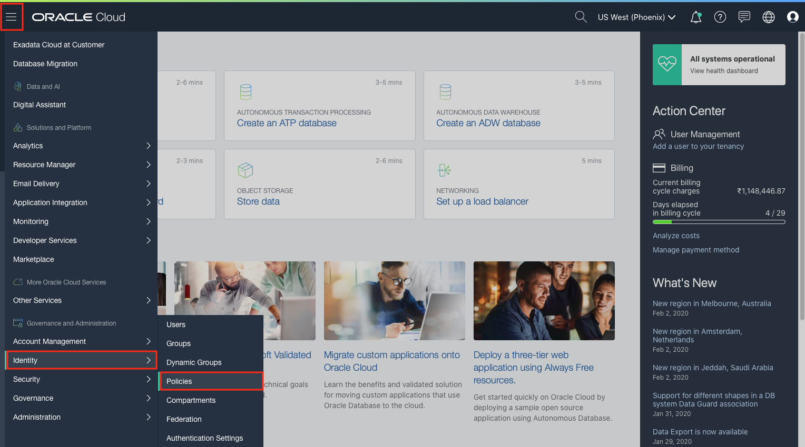

Select on left hand side menu a "root" compartment for your account (see screenshot). A list of the policies in the compartment you're viewing is displayed. If you want to attach the policy to a compartment other than the one you're viewing, select the desired compartment from the list on the left. Click **Create Policy**.

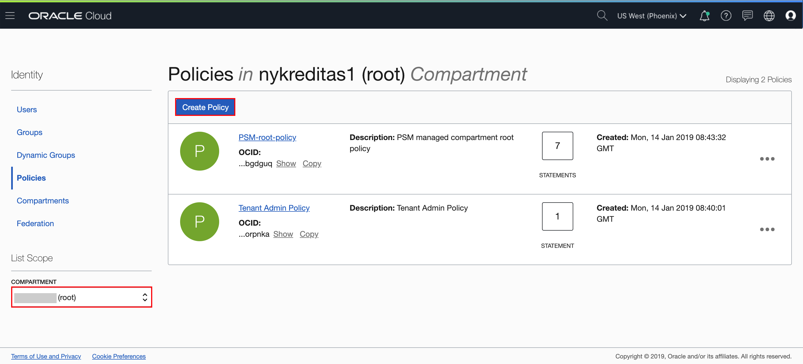

Enter the following:

- **Name:** A unique name for the policy. The name must be unique across all policies in your tenancy. You cannot change this later.
- **Description:** A friendly description.
- **Policy Versioning:** Select **Keep Policy Current**. It ensures that the policy stays current with any future changes to the service's definitions of verbs and resources.
- **Statement:** A policy statement. It MUST be: `allow service OKE to manage all-resources in tenancy`
- **Tags:** Don't apply tags.

Click **Create**.

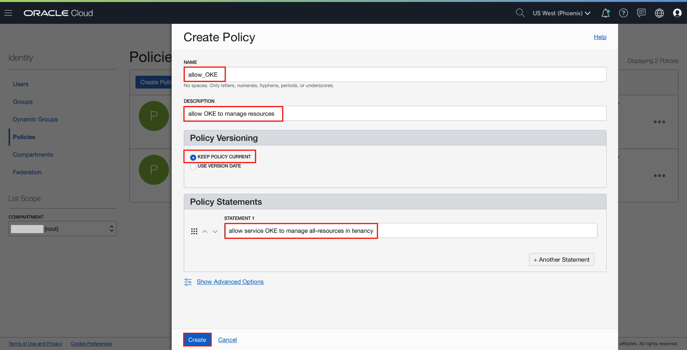

## Create OKE (Oracle Container Engine for Kubernetes) cluster ##

*Quick Create* feature uses default settings to create a *quick cluster* with new network resources as required. This approach is the fastest way to create a new cluster. If you accept all the default values, you can create a new cluster in just a few clicks. New network resources for the cluster are created automatically, along with a node pool and three worker nodes.

In the Console, open the navigation menu. Under *Solutions, Platform and Edge*, go to *Developer Services* and click **Container Clusters (OKE)**.

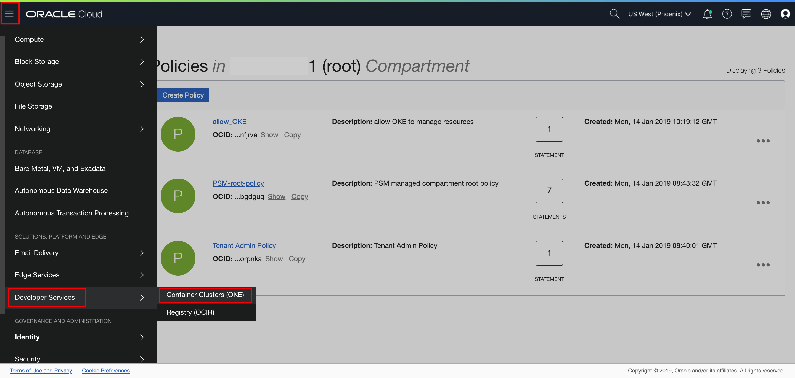

On the Cluster List page, click **Create Cluster**.

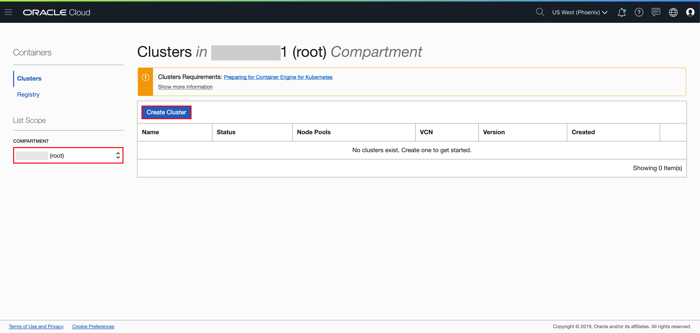

In the Create Cluster Solution dialog, select **Quick Create** and click **Launch Workflow**.

Select **Quick Create** to create a new cluster with default settings, along with new network resources for the new cluster. The Create Virtual Cloud Network panel shows the network resources that will be created for you by default, namely a VCN, two load balancer subnets, and three worker node subnets.

Specify the following configuration details on Cluster Creation page:

- **Name**: The name of the cluster. Leave the default value.
- **Compartment**: The name of your compartment. Leave the default value.
- **Kubernetes version**: The version of the Kubernetes. Leave the default value v1.15.7 or v1.14.8. **DO NOT** select v1.16 if available.
- **Choose Visibility Type**: Is the cluster going to be routable or not. Leave the default value.
- **Shape**: The shape to use for each node in the node pool. The shape determines the number of CPUs and the amount of memory allocated to each node. The list shows only those shapes available in your tenancy that are supported by Container Engine for Kubernetes. Select the available VM.Standard2.1
- **Number of nodes**: The number of worker nodes to create. Leave the default value 3
- **Kubernetes Dashboard Enabled**: Change the default true and make it ENABLED.
- **Tiller (Helm) Enabled**: Change the default true and make it ENABLED.

Click **Next** to review the details you entered for the new cluster.

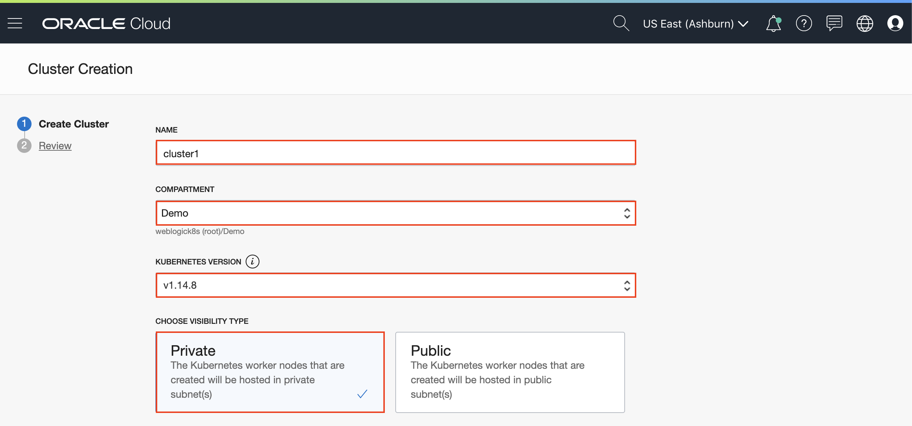
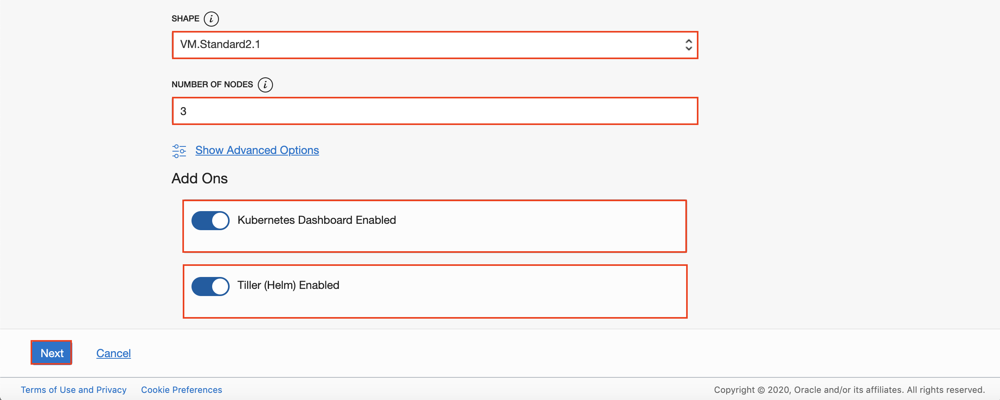

On the Review page, click **Submit** to create the new network resources and the new cluster.

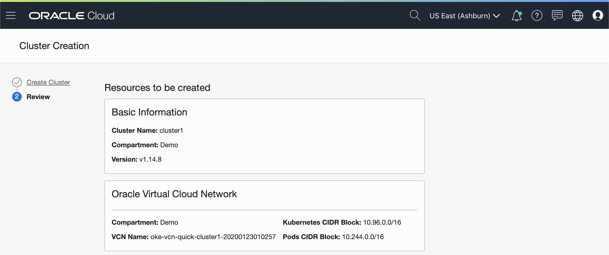

You see the different network resources being created for you.

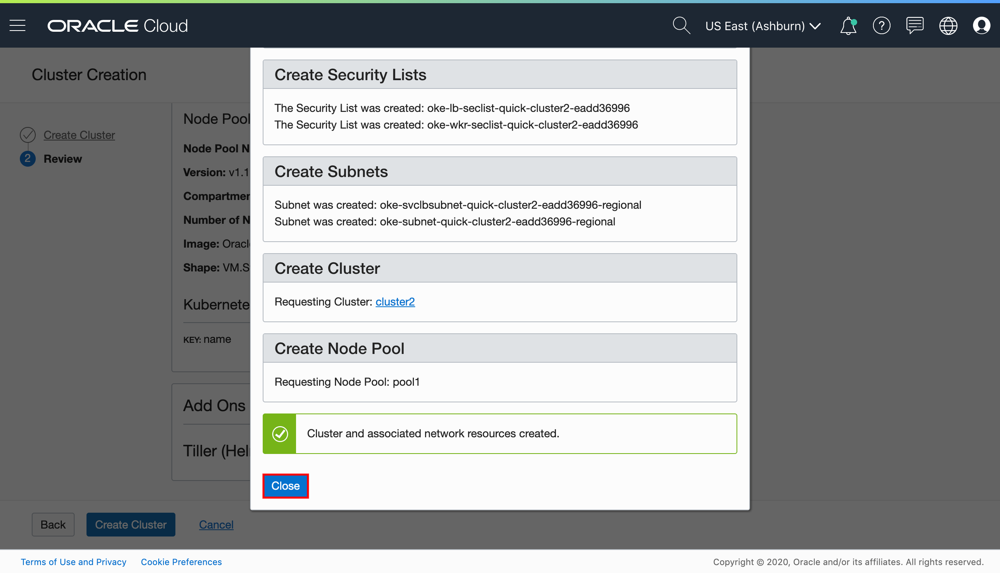

Click **Close** and the new cluster is shown on the *Cluster Details* page. When it has been created, the new cluster has a status of *Active*.

You may move on to the next lab whilst the provisioning of the cluster completes.

### You are now ready to move to the next lab - [Lab 2: Create Developer Compute VM on Oracle Cloud Infrastructure](setup.dev.compute.instance.md)  ###
